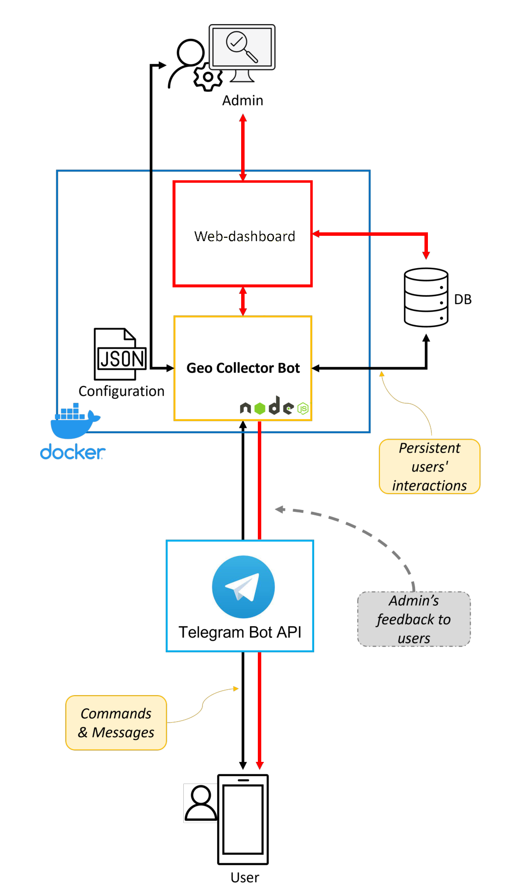

# Overview

The InsubriParks Dashboard is a web application that allows users to manage data collected on the field with the [Geo Collector Bot](https://github.com/opengeolab/geocollectorbot).  
  
In detail, for each collected data it is possible to:
- view the geographical position on a map
- consult all the information in table format
- view the multimedia data (photos, videos, ...)
- send feedback messages to the user who collected the data
- integrate the data with notes reserved for the dashboard manager

The Dashboard also allows the system administrators to monitor and analyze all the collected data through numerical statistics, linear graphs, pie diagrams, time trends, etc.

## Architecture

